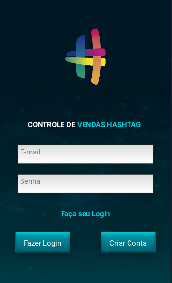
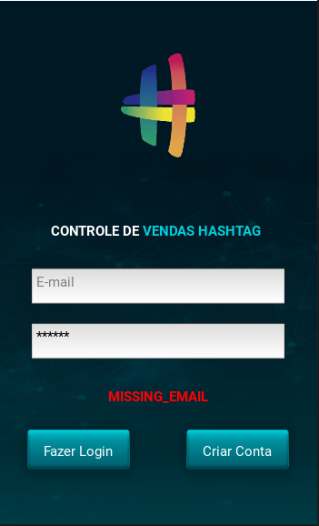
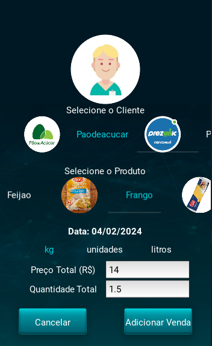
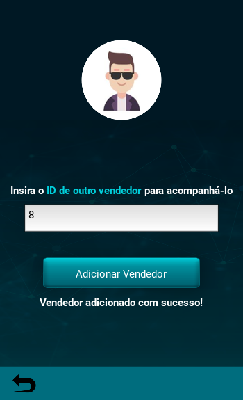

# Sales App

## Packages used:
+ kivy.app
+ kivy.lang
+ kivy.config
+ kivy.graphics
+ kivy.uix
+ requests
+ certifi
+ functools
+ datetime
+ os

## Project Description

This is a Mobile Application Project developed using Kivy framework
and Firebase database. This application aims to control a company's sales
by keeping track of each individual sale by each salesman.

## Project Structure
<ul>
    <li>The "main.py" script is responsible for running the mobile application
and defines functionalities such as: loading user data; change screen;
change profile picture; add other salesman to the contact list;
add sale's information and store that data into the database; load other user's sales;
load all company's sale;</li>
    <li>The "myFirebase.py" script is responsible for defining functionalities that
requires the REST API authentication such as: create account, login and
creating refresh token;</li>
    <li>The "kv" files creates the structure of every browsable page, 
delegating functions to each button, label and scrollview object;</li>
    <li>The "main.kv" file is responsible for managing all the other kv files,
in other words, for the screen management;</li>
    <li>"telas.py" defines an object for every page, which enables Python to
interact with kv files;</li>
    <li>"botoes.py" creates 2 hybrid objects the first one inheriting both
Image and Button features and the second one inheriting both Label
and Button features;</li>
    <li>Both "bannervendedor.py" and "bannervenda.py" creates objects that
are going to be used as widgets for specific pages of the App.</li>
</ul>

## Login/Create Account Page

    

## Login/Create Account error messages

|  |  |
|------------------------------|------------------------------|
|  |  |

## Salesman Profile

    

## Add Sale

    

## Configuration Page

    

## Change Profile Picture Page

    

## Add other user to the Contact List

    

## Contact List

    

## All Company's Sales Page

    

## Deployment

This project was deployed by using a Linux Virtual Machine to 
compile the project to an apk file and at last converting it into
an aab file which is the release version that is accepted by Google Play.

